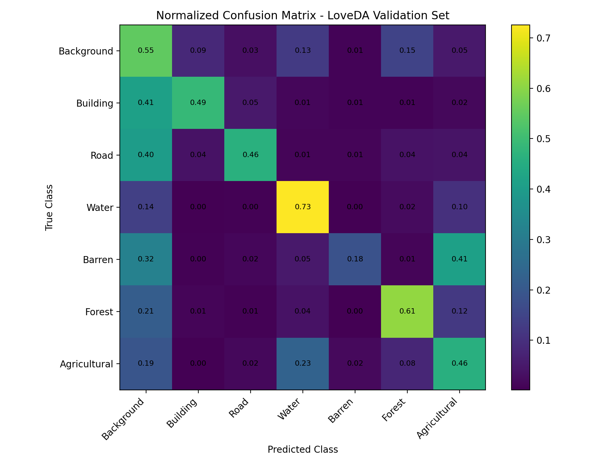
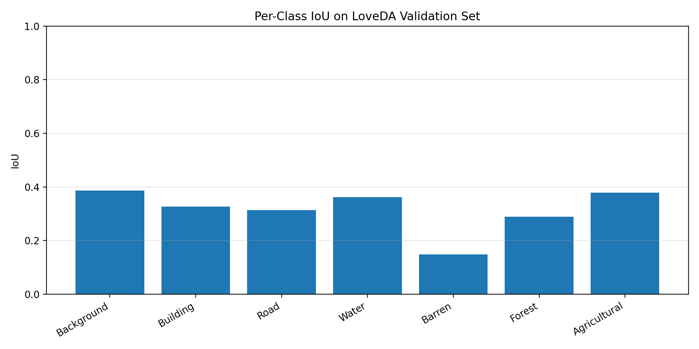

# LoveDA Semantic Segmentation Using U-Net

This project implements a complete multi-class semantic segmentation pipeline on the LoveDA remote sensing dataset using a U-Net model. The original LoveDA demo notebook was upgraded from a simple dataset visualization notebook into a full deep learning segmentation project with data preprocessing, model training, evaluation, per-class metrics, domain analysis, confusion matrix, and prediction visualization.

## Project Overview

The goal of this project is to segment satellite images into seven semantic classes:

1. Background
2. Building
3. Road
4. Water
5. Barren
6. Forest
7. Agricultural

The model is trained and evaluated on the LoveDA dataset, which contains high-resolution satellite images from both Urban and Rural domains.

## Dataset

Dataset used: LoveDA Satellite Images Semantic Segmentation

The dataset contains Urban and Rural satellite images with corresponding pixel-level segmentation masks. In this project, the dataset was downloaded from Kaggle and used for multi-class semantic segmentation.

Dataset split used in this project:

| Split      | Domain | Number of Images |
| ---------- | -----: | ---------------: |
| Train      |  Urban |             1156 |
| Train      |  Rural |             1366 |
| Validation |  Urban |              677 |
| Validation |  Rural |              992 |

Total samples used: 4191

All images and masks were resized to 256 x 256 for training and evaluation.

## Model

The implemented model is a U-Net architecture trained from scratch.

Main model components:

- Encoder-decoder U-Net structure
- Skip connections between encoder and decoder blocks
- Convolutional blocks with Batch Normalization and ReLU activation
- Dropout regularization
- Softmax output layer for 7-class segmentation

## Loss Function

The model was trained using a combined segmentation loss:

- Sparse Categorical Cross-Entropy
- Multi-class Dice Loss

Cross-Entropy helps with pixel-wise classification, while Dice Loss helps improve segmentation overlap between the predicted masks and ground-truth masks.

## Metrics

The following evaluation metrics were used:

- Pixel Accuracy
- Mean Intersection over Union, mIoU
- Per-class IoU
- Precision
- Recall
- F1-score
- Urban vs Rural domain evaluation
- Normalized confusion matrix

## Training Setup

| Parameter             |                     Value |
| --------------------- | ------------------------: |
| Image size            |                 256 x 256 |
| Batch size            |                         8 |
| Epochs                |                         8 |
| Optimizer             |                      Adam |
| Initial learning rate |                      1e-4 |
| Loss                  | Cross-Entropy + Dice Loss |
| Hardware              |          Google Colab GPU |

## Validation Results

Final validation performance of the U-Net baseline:

| Metric         |  Value |
| -------------- | -----: |
| Pixel Accuracy | 0.5230 |
| Mean IoU       | 0.3075 |

The model was trained for only 8 epochs from scratch. Therefore, these results should be interpreted as a baseline result rather than a state-of-the-art segmentation performance. The LoveDA dataset is challenging because it contains multi-class satellite images, different Urban and Rural domains, class imbalance, and visually similar land-cover regions.

## Prediction Examples

The following figure shows input satellite images, ground-truth segmentation masks, and predicted masks generated by the trained U-Net model.

## Confusion Matrix

The normalized confusion matrix shows how often each true class was predicted as each class.

## Per-Class IoU

The per-class IoU plot shows the segmentation performance for each semantic class.

## Observations

The model learns meaningful segmentation patterns, especially for visually distinctive regions such as water, forest, roads, and some agricultural areas. However, some classes are still challenging. For example, barren and agricultural regions can be visually similar in satellite images, and background pixels are sometimes confused with other land-cover classes. This is expected for a baseline U-Net trained from scratch for a limited number of epochs.

The normalized confusion matrix also shows that some classes are easier to distinguish than others. Water and forest have stronger class-level recognition, while barren, agricultural, and background regions show more confusion.

## Project Structure

- README.md
- requirements.txt
- .gitignore
- notebooks/
  - LoveDA_UNet_Semantic_Segmentation.ipynb
- assets/
  - normalized_confusion_matrix.png
  - unet_loveda_predictions.png
  - per_class_iou.png
- results/
  - unet_loveda_per_class_metrics.csv
  - unet_loveda_validation_summary.csv
  - unet_loveda_domain_metrics.csv

## How to Run

The notebook was developed and tested on Google Colab with GPU acceleration.

Steps:

1. Open the notebook in Google Colab.
2. Enable GPU from Runtime -> Change runtime type -> Hardware accelerator -> T4 GPU.
3. Install the required packages.
4. Configure Kaggle API access.
5. Download the LoveDA dataset.
6. Run the notebook cells sequentially.
7. Train the U-Net model.
8. Evaluate the model and generate visual outputs.

## Requirements

The main Python libraries used in this project are:

- tensorflow
- opencv-python
- pillow
- matplotlib
- pandas
- numpy
- scikit-learn
- tqdm

They are listed in requirements.txt.

## Notes

The trained model checkpoint is not included in this repository because model files can be large. The repository focuses on the notebook implementation, evaluation results, metrics, and visual outputs.

The Kaggle API token and dataset files are not included in this repository. Users should download the dataset separately from Kaggle.

## Conclusion

This project extends a basic LoveDA visualization notebook into a complete semantic segmentation pipeline. It includes dataset preparation, U-Net training, validation evaluation, per-class metrics, confusion matrix analysis, Urban/Rural domain evaluation, and prediction visualization.

Compared with a simple binary U-Net segmentation project, this task is more challenging because it performs multi-class semantic segmentation on satellite images and evaluates the model using detailed segmentation metrics such as mIoU and per-class IoU.
